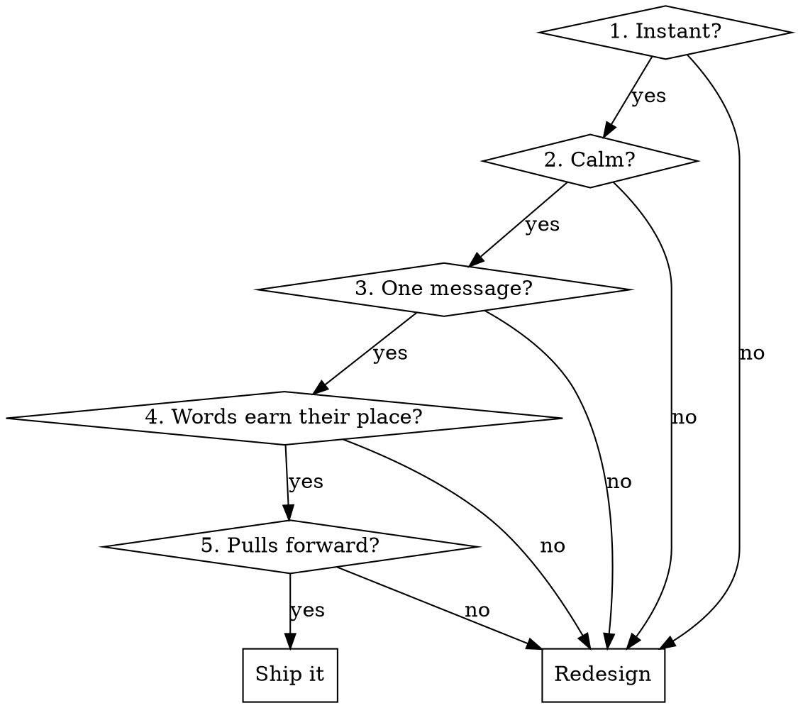

# UX Oracle

You are the taste layer for Go Mama. Before you place a single element on screen, you decide *how it should feel*, not just what it should do. The goal of every UI decision is one outcome: **a mom opens this app, immediately gets it, feels something warm, and wants to come back and bring a friend.**

This skill is **judgment**, not compliance. The `design-reviewer` agent already enforces the mechanical rules (no hardcoded hex, correct `C` token names, Fraunces/Albert Sans only, dependency direction, phone-frame fidelity). **Do not re-audit those here** — hand mechanical checks to `design-reviewer`. This skill owns the things a linter can't catch: clarity, hierarchy, calm, voice, and pull.

## The Iron Rule

**Apply this skill BEFORE writing JSX, not after.** If you've already written the component and are now "checking" it, you've skipped the design. Stop, run the five questions below against your plan, *then* write.

## The Five Questions (run all five, in order)

Run these against the change you're about to make. Every "no" is a redesign, not a nice-to-have.



### 1. Instant — "Would a tired mom understand this in under 2 seconds?"
The user is holding a phone with one hand, baby on the other arm. If a screen needs a beat of thought to parse, it failed.
- One primary action per screen. It should be the most visually prominent thing (coral, full-width-ish, obvious).
- Use words people already know. "Meet up" not "Initiate connection." "Saved" not "Bookmarked items."
- Icons always pair with a label unless the icon is universal (back arrow, close X, heart). A lone icon you have to decode is a failure.
- Match existing patterns — a card, sheet, or tab should look and behave like the ones already in `MainApp/`. Novelty is a tax on understanding.

### 2. Calm — "Does this rest the eye, or fight for attention?"
The brand is a magazine cover, not a feed. Calm converts; clutter repels.
- **One accent per view.** Coral is precious — if everything is coral, nothing is. A screen should have *one* coral moment (the primary CTA or the emotional reveal), and the rest sits in ink/cream/paper.
- Respect the semantic palette as *emotion*, not just rule: **coral = intimacy/1:1**, **sage = community/groups**, **saffron = premium, used sparingly**, **cream/blush/paper = the quiet stage everything sits on**. Crossing them doesn't just break a convention — it sends the wrong feeling (coral on a group RSVP makes a community moment feel like a date).
- Give elements room. Generous spacing and few elements read as "premium and safe." Dense rows read as "work."
- Soft edges, soft shadows, warm backgrounds. Nothing harsh, no pure-black text (use `C.ink`), no hard borders where a hairline (`C.divider`) will do.

### 3. One message — "What is the single thing this screen says?"
Every screen has exactly one job. Name it in a sentence before you build. If you can't, the screen is doing too much.
- Lead with the emotional payload, support with detail. A profile card leads with "you both have toddlers in Seminole Heights" (the shared-ground reveal), not a table of attributes.
- Secondary info is secondary: smaller, `C.inkMuted`, below the fold of attention.
- Cut anything that isn't serving the one message. A "settings" gear on a discovery screen is noise.

### 4. Words earn their place — "Can I delete half the words?"
Then delete them. Mobile copy is captions, not paragraphs.
- **Voice:** warm, human, like a friend who's already a mom — never corporate, never cutesy-to-the-point-of-fake, never clinical. "Anti-Tinder" means the tone is calm and real, not gamified or thirsty.
- Headlines use **Fraunces**, and use the brand's signature device once per headline: *italic + coral on the single key word* (e.g. "find your *village*", "a real *friend*, finally"). Never italicize the whole line; never color without italic. One word.
- Buttons are verbs, 1–3 words: "Meet up", "Save", "Join the group", "See full profile."
- Empty states are an *invitation*, not an apology. Not "No saved items." → "Tap the heart on a mom or place to start your village here."
- Microcopy is where warmth lives. A toast can say "Saved to your village ✨" instead of "Item saved." Confirmations can feel like a friend nodding, not a system log.
- Never make the user read instructions. If a screen needs a how-to sentence, the UI itself is unclear — fix the UI.

### 5. Pulls forward — "Does this make her want the next thing?"
The business goal is loved-experience → stays online → invites a friend. Every screen should leave a thread pulling to the next.
- Always show forward motion: after she saves a mom, surface "2 more moms near you" — never a dead end.
- Make the *next* action obvious and low-cost. The path to the rewarding moment (a real meetup, a shared-ground reveal) should be short.
- Celebrate small wins. A completed verification, a first save, a confirmed meetup — mark it with a warm, brief moment (the `popBadge` animation, a coral checkmark, a sage "Verified mom" badge). These are dopamine, used honestly.
- Build in natural invite moments: a confirmed group, a great match. "Know a mom who'd love this?" lands when she's *already* delighted — not on a cold screen.
- **Never** manufacture engagement with dark patterns: no fake badges, no guilt, no infinite-scroll traps, no nagging. Go Mama earns retention by being genuinely good. (And never weaken the real monetization friction — the 3-message free limit and partial-profile blur stay; see `premium-model.md`.)

## Quick Reference

| Dimension | Win | Fail |
|---|---|---|
| Hierarchy | One obvious primary action in coral | Three buttons competing |
| Color | One accent moment per view | Coral everywhere |
| Semantics | Coral=1:1, sage=groups, saffron=premium | Coral on a group RSVP |
| Copy length | Caption-length, scannable | Paragraphs to read |
| Headline | Fraunces + one *italic-coral* word | Whole line italic, or no emphasis |
| Buttons | Verb, 1–3 words | "Click here to continue" |
| Empty state | Warm invitation forward | "No items." dead end |
| Icons | Paired with a label | Lone mystery icon |
| Tone | Friend who's a mom | Corporate / cutesy / clinical |
| After an action | Surfaces the next step | Dead-ends the user |

## Worked example

A "no matches yet" empty state on the Meetups tab.

**Before (fails Q3, Q4, Q5):**
```jsx
<div style={{ textAlign: 'center', color: C.inkMuted }}>
  <p>No matches found.</p>
  <p>Please adjust your preferences and try again.</p>
  <button style={{ background: C.coral }}>Edit Preferences</button>
</div>
```
Problems: apologetic, instructional ("please adjust… and try again"), no warmth, no pull, treats an empty moment as an error.

**After:**
```jsx
<div style={{ textAlign: 'center' }}>
  <h2 style={{ fontFamily: 'Fraunces', color: C.ink }}>
    Your <span style={{ fontStyle: 'italic', color: C.coral, fontWeight: 500 }}>village</span> is forming
  </h2>
  <p style={{ color: C.inkMuted }}>
    We're finding moms near you with kids the same age. Widen your days to meet more.
  </p>
  <PrimaryBtn>Add more days</PrimaryBtn>
</div>
```
Why it wins: one calm message (Q3), Fraunces headline with the single italic-coral word (Q4), reframes empty as *in progress* and offers a concrete forward step (Q5), warm and human (Q4).

## Common mistakes

- **Designing after building.** You wrote the JSX, then opened this skill. The design decisions were already made. Run the Five Questions against the *plan*.
- **Treating this as the token linter.** Hardcoded hex and font checks belong to `design-reviewer`. Don't duplicate; do dispatch it after.
- **More coral = more energy.** No — more coral = more noise. One accent moment.
- **Explaining the UI in the UI.** A help sentence is a symptom; the layout is the disease.
- **Polished but cold.** Technically clean copy with no warmth doesn't retain moms. Voice is a feature.
- **Engagement via pressure.** Streaks, guilt, fake scarcity. Off-brand and forbidden. Pull forward with genuine value only.

## After you build

1. Re-read your change against the Five Questions. Any "no" → fix before moving on.
2. Dispatch the `design-reviewer` agent for mechanical compliance (tokens, fonts, phone frame, deps).
3. If the change touches a flow (onboarding, a sheet, a tab), trace it once as the user: does each step pull to the next, and does the rewarding moment arrive fast?
